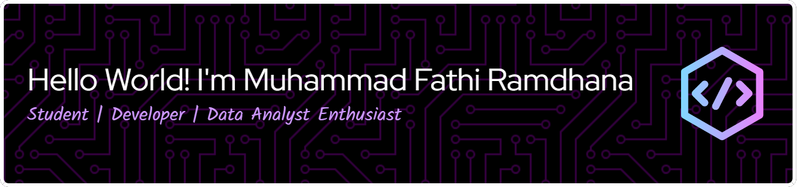

#### 💫 About Me

A Software Engineering Technology student at **IPB University** from Bogor, Indonesia. I'm passionate about building data-driven solutions at the intersection of **Web Development** and **Data Analysis**.

  &nbsp;
  
  

---

#### 🛠️ Tech Stack

  

#### 🌱 Current Focus

- Currently focused on building full-stack applications with **Laravel** and **Modern JavaScript**, aiming to integrate data analysis and AI features.
  
---

#### 📊 GitHub Stats

  &nbsp;&nbsp;

---

  <i>Feel free to explore my repositories below to see my work!</i>

